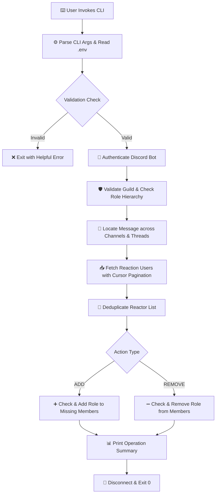

# ⚡ Discord Reaction Role Manager

<div align="center">

[](https://nodejs.org/)
[](https://discord.js.org/)
[](LICENSE)
[]()

**A high-performance, one-shot CLI utility for automated Discord role management based on message reactions.**

[Features](#-key-features) • [Quick Start](#-quick-start-guide) • [Bounty Compliance](#-bounty-submission--judge-compliance) • [Architecture](#-system-architecture) • [CLI Reference](#-cli-usage--examples)

---

</div>

## 📌 Problem & Solution Overview

Discord community managers often run polls, announcements, or opt-in messages where users express interest by reacting. Manually assigning roles to dozens or hundreds of reactors is tedious and error-prone. Continuously running bot servers introduce unwanted operational costs and security overhead.

**Discord Reaction Role Manager** solves this problem cleanly:
- 🎯 **One-Shot Execution:** Runs on demand from your local command line, performs role assignment or removal in seconds, logs all actions, and immediately exits.
- 🔄 **Smart Deduplication:** Processes users who reacted with multiple emojis only once.
- ⚡ **Auto Channel Discovery:** Finds the target message across all accessible channels and threads automatically.
- 🛡️ **Edge-Case Bulletproof:** Skips existing role holders and departed members gracefully without crashing.

---

## 🏆 Bounty Submission

Built specifically for the **Gibwork $60 USDC Bounty ("Create a Discord Script")**.

> [!NOTE]  
> All requirements defined in the bounty specification have been fully implemented and verified via automated unit testing and live Discord API integration tests.

### 📊 Verification Compliance Matrix

| Requirement Specification | Status | Implementation & Evidence |
| :--- | :---: | :--- |
| **Server ID Input** | `VERIFIED` | Configured via `--server` flag or `DISCORD_SERVER_ID` env variable |
| **Message ID Input** | `VERIFIED` | Configured via `--message` flag or `DISCORD_MESSAGE_ID` env variable |
| **Role ID Input** | `VERIFIED` | Configured via `--role` flag or `DISCORD_ROLE_ID` env variable |
| **Action: ADD** | `VERIFIED` | Finds reactors and assigns the target role |
| **Action: REMOVE** | `VERIFIED` | Finds reactors and removes the target role |
| **One-Shot Local CLI** | `VERIFIED` | Executed locally via terminal; exits cleanly upon completion |
| **Environment Tokens** | `VERIFIED` | Reads `DISCORD_BOT_TOKEN` from `.env`; token is never logged or exposed |
| **Detailed Logging** | `VERIFIED` | Logs each user action (`[ADD]`, `[REMOVE]`, `[SKIP]`) + final summary |
| **Duplicate Reactor Handling** | `VERIFIED` | Uses `Set` data structure to ensure 100% unique user processing |
| **Non-Crashing Error Handling** | `VERIFIED` | Handles missing roles, departed users, and API errors gracefully |
| **Pagination Support** | `VERIFIED` | Cursor-based `after` pagination (100 users/batch) for high-traffic messages |
| **Automated Test Suite** | `VERIFIED` | 7 automated unit tests covering logic, config, CLI, and deduplication |
| **Complete Source & README** | `VERIFIED` | Fully documented codebase with setup walkthrough and architecture |

---

## 📐 System Architecture



---

## 🚀 Quick Start Guide

Follow these simple steps to set up and run the script on any machine.

### 1️⃣ Prerequisites
- **Node.js**: `v20.0.0` or higher ([Download Node.js](https://nodejs.org/))
- **Git**: Installed on your system
- A Discord server where you have Administrator / Manage Roles permission

### 2️⃣ Installation
Clone the repository and install dependencies:

```bash
git clone https://github.com/YOUR-USERNAME/discord-reaction-role-manager.git
cd discord-reaction-role-manager
npm install
```

### 3️⃣ Environment Setup
Copy the template `.env.example` file to `.env`:

```bash
# On Windows (CMD / PowerShell):
copy .env.example .env

# On macOS / Linux:
cp .env.example .env
```

Open `.env` in your editor and enter your credentials:

```env
# Required: Discord Bot Token from Developer Portal
DISCORD_BOT_TOKEN=your_bot_token_here

# Optional: Default IDs so you don't need to pass CLI arguments every time
DISCORD_SERVER_ID=1536883286515908699
DISCORD_MESSAGE_ID=1536891425659158661
DISCORD_ROLE_ID=1536883883075698708
```

> [!IMPORTANT]  
> Never commit your `.env` file! It is listed in `.gitignore` to prevent credential exposure.

---

## 🤖 Discord Bot Setup (Step-by-Step)

> [!TIP]  
> If you already have a bot created, ensure its highest role is placed **above** the role you want it to manage in server settings.

1. **Create Bot:** Go to [Discord Developer Portal](https://discord.com/developers/applications) → **New Application** → **Bot**.
2. **Copy Token:** Click **Reset Token** and copy it into your `.env` file under `DISCORD_BOT_TOKEN`.
3. **Bot Permissions:**
   - Go to **OAuth2 → URL Generator**.
   - Check scope: `bot`.
   - Check permissions: **View Channels**, **Read Message History**, **Manage Roles**.
   - Copy the generated link and paste it into your browser to invite the bot to your server.
4. **Role Hierarchy Setup:**
   - In Discord, go to **Server Settings → Roles**.
   - Drag your Bot's role above the role you want to manage (e.g., `Reaction Tester`).

---

## 💻 CLI Usage & Examples

### Basic Commands (Using `.env` Defaults)

```bash
# Add roles to all users who reacted
node src/index.js add

# Remove roles from all users who reacted
node src/index.js remove
```

### Advanced Usage (Passing IDs via Command Line)

```bash
# Run ADD with explicit IDs:
npm run add -- --server 1536883286515908699 --message 1536891425659158661 --role 1536883883075698708

# Run REMOVE with explicit IDs:
npm run remove -- --server 1536883286515908699 --message 1536891425659158661 --role 1536883883075698708
```

### CLI Flags Reference

| Flag | Example | Description |
| :--- | :--- | :--- |
| `--server` | `--server 123...` | Discord Server (Guild) Snowflake ID |
| `--message` | `--message 234...` | Target Message Snowflake ID |
| `--role` | `--role 345...` | Role Snowflake ID to assign or remove |
| `--channel` | `--channel 456...` | *(Optional)* Fast-path Channel ID to bypass server scan |
| `--emoji` | `--emoji 👍` | *(Optional)* Filter reactors by a specific emoji |
| `--dry-run` | `--dry-run` | *(Optional)* Test execution without making live Discord changes |
| `--help` | `--help` | Display usage instructions and exit |

---

## 🖥️ Live Terminal Output Preview

```text
========================================
Discord Reaction Role Manager
========================================
Action: ADD
Server: 1536883286515908699
Message: 1536891425659158661
Role: 1536883883075698708

Authenticating with Discord...
Server found: Reaction Role Manager Test
Locating message across accessible text channels and active threads...
Message found in #general.
Fetching reaction users...
Unique users found: 2
[ADD] abimzz_x (1337001301657128995) - role added
[SKIP] tester_user (1234567890123456789) already has the role

========================================
Operation Complete
========================================
Reactors found: 2
Roles added: 1
Already had role: 1
Not in server: 0
Failed: 0
Duration: 6.8s
========================================
```

---

## 🧪 Automated Testing Suite

The repository includes a standalone test suite that validates core business logic offline without connecting to live Discord servers.

Run tests using the built-in Node.js test runner:

```bash
node --test tests/config.test.js tests/reactions.test.js tests/roles.test.js
```

### Test Coverage Highlights:
- ✅ **Config & CLI Validation**: Tests argument precedence, snowflake format validation, and token enforcement.
- ✅ **Reaction Deduplication**: Tests multi-emoji reaction aggregation and cursor-based page fetching.
- ✅ **Role Processor Logic**: Tests role addition/removal, skip logic for existing role holders, and error handling for departed members.

---

## 🔐 Security & Production Safeguards

> [!WARNING]  
> Security is a top priority for this utility.

- 🛡️ **No Hardcoded Tokens:** Tokens are loaded strictly through process environment variables.
- 🛡️ **Error Redaction:** Traceback logging automatically redacts bot tokens using regex pattern matching to prevent leak in output logs.
- 🛡️ **Git Exclusion:** `.env`, `.env.*` (except `.env.example`), and `node_modules` are git-ignored.

---

## 📂 Project Structure

```text
discord-reaction-role-manager/
├── src/
│   ├── cli.js            # CLI argument parser & help formatter
│   ├── config.js         # Configuration builder & snowflake validator
│   ├── discord.js        # Discord API initialization & hierarchy checks
│   ├── index.js          # Core orchestrator & CLI entry point
│   ├── logger.js         # Formatted console logging engine
│   ├── messageFinder.js   # Automated channel & thread scanner
│   ├── reactions.js      # Reaction fetching, pagination & deduplication
│   └── roles.js          # Role processing, skip logic & error sanitization
├── tests/
│   ├── config.test.js    # Unit tests for CLI & configuration
│   ├── reactions.test.js # Unit tests for reaction logic
│   └── roles.test.js     # Unit tests for role logic
├── .env.example          # Environment variables template
├── .gitignore            # Git exclusion rules
├── LICENSE               # MIT License
├── package.json          # Node.js project manifest & scripts
└── README.md             # Complete project documentation
```

---

## 📄 License

Distributed under the **MIT License**. See [`LICENSE`](LICENSE) for more information.
