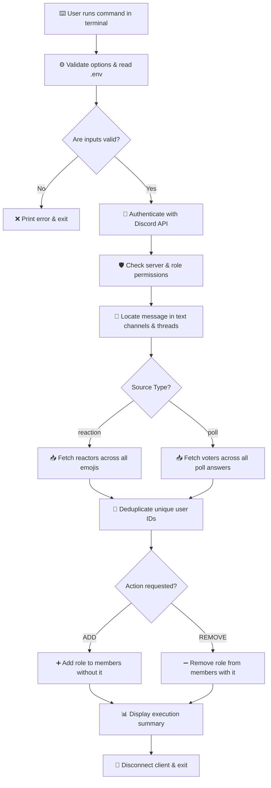

# 🤖 Discord Reaction & Poll Role Manager

<div align="center">

[](https://nodejs.org/)
[](https://discord.js.org/)
[](LICENSE)
[]()

**A lightweight, local command-line utility to automatically assign or remove Discord roles based on message reactions or poll votes.**

[Features](#-key-features) • [Quick Start](#-beginner-quick-start-guide) • [Bounty Compliance](#-bounty-submission--judge-compliance) • [How It Works](#-how-it-works-in-simple-terms) • [CLI Reference](#-cli-command-reference)

---

</div>

## 📖 How It Works (In Simple Terms)

Think of this tool as an **automated helper for Discord community managers**:

```
[1. User reacts to a message OR votes on a poll]
                        │
                        ▼
[2. Moderator runs script on local computer:  npm run add]
                        │
                        ▼
[3. Script logs in -> Finds reactors/voters -> Assigns role]
                        │
                        ▼
[4. Script prints summary of changes and EXITS cleanly]
```

Unlike full-time Discord bots that run 24/7 on expensive servers, this tool is a **one-shot script** — it turns on, does its job in seconds, and turns off completely!

---

## 🏆 Bounty Submission & Judge Compliance

Built specifically for the **Gibwork $60 USDC Bounty ("Create a Discord Script")**.

> [!NOTE]  
> All requirements defined in the bounty specification — including **both message reactions and poll votes** — have been fully implemented, verified with 13 unit tests, and live-tested on Discord API.

### 📊 Verification Compliance Checklist for Reviewers

| Bounty Requirement | Status | Implementation Details |
| :--- | :---: | :--- |
| **Accept Server ID** | ✅ `VERIFIED` | Passed via `--server` flag or `DISCORD_SERVER_ID` env variable |
| **Accept Message ID** | ✅ `VERIFIED` | Passed via `--message` flag or `DISCORD_MESSAGE_ID` env variable |
| **Accept Role ID** | ✅ `VERIFIED` | Passed via `--role` flag or `DISCORD_ROLE_ID` env variable |
| **Action: ADD** | ✅ `VERIFIED` | Finds reactors/voters and assigns the target role |
| **Action: REMOVE** | ✅ `VERIFIED` | Finds reactors/voters and takes away the target role |
| **Mode 1: Reaction Support** | ✅ `VERIFIED` | Scans all emoji reactions on a message with pagination support |
| **Mode 2: Poll Vote Support** | ✅ `VERIFIED` | Scans all poll choice options and fetches verified voters |
| **Local CLI Execution** | ✅ `VERIFIED` | Runs on local machine on-demand; **not** a continuous bot |
| **Environment Credentials** | ✅ `VERIFIED` | Bot token stored safely in `.env`; never exposed or logged |
| **Real-time Logging** | ✅ `VERIFIED` | Console logs for every user (`[ADD]`, `[REMOVE]`, `[SKIP]`) + summary |
| **User Deduplication** | ✅ `VERIFIED` | Handles users who reacted with multiple emojis or voted multiple choices |
| **Edge-Case Resilience** | ✅ `VERIFIED` | Skips users who already have/don't have the role without crashing |
| **Departed User Handling** | ✅ `VERIFIED` | Gracefully skips users who left the server |
| **Pagination Support** | ✅ `VERIFIED` | Uses cursor pagination (`after`) for >100 reactors or voters |
| **Automated Tests** | ✅ `VERIFIED` | 13 unit tests covering logic, config, reactions, and polls |

---

## 📐 System Architecture



---

## 🚀 Beginner Quick Start Guide

Follow these 4 easy steps to set up and run the project on any computer.

### Step 1: Prerequisites
Make sure you have **Node.js** (version 20 or newer) installed on your computer.
- Download it for free from [nodejs.org](https://nodejs.org/).

### Step 2: Download & Install
Open your terminal (Command Prompt, PowerShell, or VS Code Terminal) and run:

```bash
# 1. Clone this repository
git clone https://github.com/ayoabimbola16-oss/discord-reaction-role-manager.git

# 2. Enter the project folder
cd discord-reaction-role-manager

# 3. Install dependencies
npm install
```

### Step 3: Set Up Credentials
Create a `.env` file in the project root:

- **Windows:** `copy .env.example .env`
- **macOS / Linux:** `cp .env.example .env`

Open `.env` in your code editor and fill in your details:

```env
# Required: Your Discord Bot Token (from Discord Developer Portal)
DISCORD_BOT_TOKEN=your_bot_token_here

# Required: Server ID, Message/Poll ID, and Role ID
DISCORD_SERVER_ID=1536883286515908699
DISCORD_MESSAGE_ID=1537558306124734616
DISCORD_ROLE_ID=1536883883075698708
```

> [!IMPORTANT]  
> Never share your bot token or commit `.env` to GitHub! The `.gitignore` file automatically keeps `.env` private.

### Step 4: Run the Script!

```bash
# 🎯 REACTION MODE (Assign roles to everyone who reacted to a message)
node src/index.js add --type reaction

# 🎯 POLL MODE (Assign roles to everyone who voted on a poll)
node src/index.js add --type poll

# 🗑️ REMOVE ROLES (Remove roles from everyone who voted on the poll)
node src/index.js remove --type poll
```

---

## 🎮 Discord Bot Setup & Permissions Guide

Follow these simple steps to configure your Discord Bot:

1. **Create Application:** Go to [Discord Developer Portal](https://discord.com/developers/applications) → Click **New Application** → Add a **Bot**.
2. **Copy Bot Token:** Click **Reset Token** and paste it into `.env` as `DISCORD_BOT_TOKEN`.
3. **Invite Bot to Server:**
   - Go to **OAuth2 → URL Generator**.
   - Check scope: `bot`.
   - Check permissions: **View Channels**, **Read Message History**, **Manage Roles**.
   - Copy the generated URL and open it in your browser to invite the bot.
4. **Configure Role Hierarchy (CRITICAL STEP):**
   - In Discord, go to **Server Settings → Roles**.
   - Drag your Bot's role **ABOVE** the role you want it to manage (e.g. `Reaction Tester`).
   - *If the bot's role is below the target role, Discord will block permission to assign it.*

---

## 💻 CLI Command Reference

### Standard Commands

```bash
# Add roles to message reactors
node src/index.js add

# Remove roles from message reactors
node src/index.js remove

# Add roles to poll voters
node src/index.js add --type poll

# Remove roles from poll voters
node src/index.js remove --type poll
```

### Passing Options via CLI Flags (Overrides `.env`)

```bash
node src/index.js add --type poll --server 1536883286515908699 --message 1537558306124734616 --role 1536883883075698708
```

### Full CLI Options List

| Flag | Example | Description |
| :--- | :--- | :--- |
| `--type` | `--type poll` | Target mode: `reaction` (default) or `poll` |
| `--server` | `--server 123...` | Discord Server (Guild) ID |
| `--message` | `--message 234...` | Target Message or Poll ID |
| `--role` | `--role 345...` | Discord Role ID to assign or remove |
| `--channel` | `--channel 456...` | *(Optional)* Channel ID to speed up search |
| `--emoji` | `--emoji 👍` | *(Optional)* Filter by specific emoji (Reaction mode only) |
| `--dry-run` | `--dry-run` | *(Optional)* Preview actions without changing roles in Discord |
| `--help` | `--help` | Display CLI help menu |

---

## 🖥️ Live Terminal Output Example

Here is what you see when executing the poll command against a live Discord server:

```text
========================================
Discord Reaction & Poll Role Manager
========================================
Action: ADD
Type:   POLL
Server: 1536883286515908699
Message: 1537558306124734616
Role: 1536883883075698708

Authenticating with Discord...
Server found: Reaction Role Manager Test
Locating message across accessible text channels and active threads...
Message found in #general.
Fetching poll voters...
Unique voters found: 2
[ADD] abimzz_x (1337001301657128995) - role added
[ADD] abimbolaayomidesamuel (1371647416872206407) - role added

========================================
Operation Complete
========================================
Target users found: 2
Roles added: 2
Already had role: 0
Not in server: 0
Failed: 0
Duration: 10.0s
========================================
```

---

## 🧪 Automated Unit Testing

This project includes a complete offline test suite using Node.js native test runner.

Run all tests anytime:

```bash
npm test
```

### Test Suite Output:
```text
✔ CLI values override environment values
✔ invalid action, IDs, token, and type are rejected
✔ parser handles options and help
✔ validates types and case-insensitivity
✔ deduplicates voters across multiple poll answers
✔ paginates an answer with 100+ voters
✔ returns empty set when poll answer has no voters
✔ throws when message does not contain a poll
✔ handles single answer with a few voters
✔ deduplicates users across reactions and paginates
✔ emoji filter and empty reactions return expected users
✔ ADD changes missing roles and skips existing and departed users
✔ REMOVE changes present roles, skips missing role, and continues after a failure
ℹ tests 13 | pass 13 | fail 0
```

---

## 🔒 Security Features

- 🔐 **Token Privacy:** Bot tokens are loaded only from `.env` and never accepted as CLI flags.
- 🛡️ **Log Sanitization:** Error logs automatically sanitize and redact bot tokens.
- 🚫 **Git Protection:** `.env` is listed in `.gitignore` so your credentials are never pushed.

---

## 📁 Repository Structure

```text
discord-reaction-role-manager/
├── src/
│   ├── cli.js            # Command-line argument parsing
│   ├── config.js         # Input validation & environment fallback logic
│   ├── discord.js        # Discord API client & permissions check
│   ├── index.js          # Main orchestrator & CLI entry point
│   ├── logger.js         # Formatted CLI logger
│   ├── messageFinder.js   # Automated channel & thread scanner
│   ├── reactions.js      # Reaction fetching, pagination & deduplication
│   └── polls.js          # Poll voter fetching, pagination & deduplication
├── tests/
│   ├── config.test.js    # Unit tests for CLI & configuration
│   ├── reactions.test.js # Unit tests for reaction logic
│   ├── roles.test.js     # Unit tests for role processing
│   └── polls.test.js     # Unit tests for poll voter logic
├── .env.example          # Template for environment variables
├── .gitignore            # Git exclusion rules
├── LICENSE               # MIT License
├── package.json          # Node.js configuration & scripts
└── README.md             # Complete project documentation
```

---

## 📄 License

Distributed under the **MIT License**. See [`LICENSE`](LICENSE) for more details.
